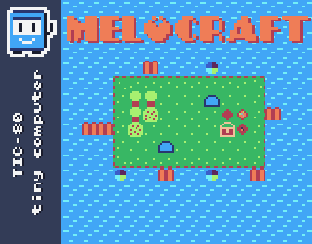
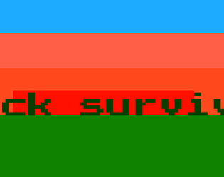

## Hi there 👋

I'm ElStep. I make video games. I use **Lua, Zig and Godot.** I love fantasy consoles and pixel art.

- Email: electroblaststep@proton.me
- X/Twitter: [@realElStep](https://x.com/realElStep)
- TIC-80: [E1Step](https://tic80.com/dev?id=13737)
- Itch.io: [ElStep](https://electroblaststep.itch.io/)
- YouTube: [ElStep](https://youtube.com/@electroblaststep?si=Hm-nMUii0YrNN8qt)

**Currently working: Melocraft, Metagun TIC-80 demake**

## My interests:
- GTA Vice City
- Balatro

- [Puppies and Kittens](https://parovoz.tv/en/koshechki-sobachki)
- Geometry dash

## Genres:
- Platformer
- Survival

## My games:
- [Melocraft](https://electroblaststep.itch.io/melocraft)

- [Stack survival](https://electroblaststep.itch.io/stack-survival) (abandoned)

